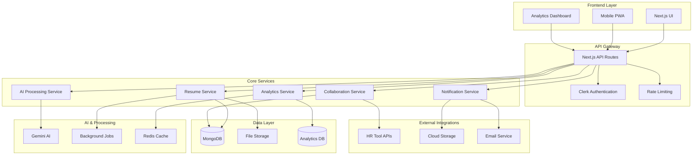

# Domain 1 Compliance Design Document

## Overview

This design document outlines the architecture and implementation strategy to transform the AI Resume Coach into a fully Domain 1 compliant productivity tool. The design focuses on adding missing critical features while enhancing existing functionality to meet all domain requirements: efficiency, user-centric design, real-world applicability, meaningful AI integration, scalability, impact measurement, and data privacy.

## Architecture

### High-Level System Architecture



### Enhanced Data Models

#### User Model Extensions
```typescript
interface EnhancedUser {
  // Existing fields
  clerkId: string;
  email: string;
  firstName: string;
  lastName: string;
  
  // New fields for Domain 1 compliance
  preferences: {
    onboardingCompleted: boolean;
    helpTooltipsEnabled: boolean;
    notificationSettings: NotificationPreferences;
    privacySettings: PrivacySettings;
  };
  careerProfile: {
    currentRole: string;
    targetRole: string;
    experienceLevel: string;
    industries: string[];
    careerGoals: string[];
  };
  analytics: {
    resumeViews: number;
    applicationsSent: number;
    interviewsReceived: number;
    lastActivityDate: Date;
  };
}
```

#### Analytics Model
```typescript
interface ResumeAnalytics {
  resumeId: string;
  userId: string;
  metrics: {
    atsScore: number;
    keywordMatch: number;
    readabilityScore: number;
    impactScore: number;
  };
  performance: {
    views: number;
    downloads: number;
    applications: number;
    interviews: number;
    offers: number;
  };
  improvements: {
    beforeScore: number;
    afterScore: number;
    timeSaved: number; // in minutes
    suggestionsImplemented: number;
  };
  timestamps: {
    created: Date;
    lastUpdated: Date;
    lastViewed: Date;
  };
}
```

#### Collaboration Model
```typescript
interface CollaborationSession {
  id: string;
  resumeId: string;
  ownerId: string;
  collaborators: {
    userId: string;
    role: 'viewer' | 'commenter' | 'editor';
    permissions: string[];
  }[];
  comments: {
    id: string;
    userId: string;
    content: string;
    position: { section: string; line?: number };
    status: 'open' | 'resolved';
    timestamp: Date;
  }[];
  versions: {
    id: string;
    authorId: string;
    changes: object;
    timestamp: Date;
    approved: boolean;
  }[];
}
```

## Components and Interfaces

### 1. Enhanced AI Processing Service

#### AI Explanation Engine
```typescript
interface AIExplanationService {
  explainSuggestion(suggestion: ResumeSuggestion): {
    reasoning: string;
    impact: string;
    alternatives: string[];
    confidence: number;
  };
  
  generatePersonalizedRecommendations(
    userProfile: CareerProfile,
    resumeData: ResumeData,
    targetJob: JobDescription
  ): PersonalizedRecommendation[];
  
  analyzeSkillGaps(
    currentSkills: string[],
    requiredSkills: string[]
  ): SkillGapAnalysis;
}
```

#### Real-time Processing Engine
```typescript
interface RealTimeProcessor {
  processIncrementalChanges(
    resumeId: string,
    changes: ResumeChange[]
  ): Promise<InstantFeedback>;
  
  provideLiveSuggestions(
    content: string,
    context: ProcessingContext
  ): Promise<LiveSuggestion[]>;
  
  calculateImpactScore(
    originalContent: string,
    modifiedContent: string
  ): ImpactScore;
}
```

### 2. Analytics and Impact Measurement System

#### Analytics Dashboard Service
```typescript
interface AnalyticsDashboardService {
  generateUserDashboard(userId: string): Promise<UserAnalytics>;
  
  trackResumePerformance(resumeId: string): Promise<ResumeMetrics>;
  
  calculateROI(userId: string): Promise<ROIMetrics>;
  
  generateBenchmarkReport(
    userId: string,
    anonymizedPeerData: PeerData[]
  ): Promise<BenchmarkReport>;
  
  predictSuccessLikelihood(
    resumeData: ResumeData,
    jobDescription: JobDescription
  ): Promise<SuccessPrediction>;
}
```

#### Impact Tracking Components
- **Before/After Comparison Widget**: Visual diff showing improvements
- **Success Metrics Dashboard**: Interview rates, application success
- **Time Savings Calculator**: Quantified efficiency gains
- **ATS Compatibility Scorer**: Real-time ATS optimization feedback

### 3. User Experience Enhancement System

#### Onboarding Service
```typescript
interface OnboardingService {
  createPersonalizedTour(userProfile: UserProfile): OnboardingFlow;
  
  trackOnboardingProgress(userId: string): OnboardingProgress;
  
  adaptTourBasedOnBehavior(
    userId: string,
    interactions: UserInteraction[]
  ): AdaptedOnboarding;
}
```

#### Contextual Help System
```typescript
interface ContextualHelpService {
  getContextualHelp(
    currentPage: string,
    userAction: string,
    userProfile: UserProfile
  ): HelpContent;
  
  generateSmartTooltips(
    elementId: string,
    userExperience: ExperienceLevel
  ): SmartTooltip;
  
  provideAlternativeInteractions(
    failedAction: string,
    userCapabilities: AccessibilityProfile
  ): AlternativeMethod[];
}
```

### 4. Privacy and Security Framework

#### Privacy Control Center
```typescript
interface PrivacyControlService {
  manageDataConsent(userId: string): ConsentManager;
  
  encryptSensitiveData(data: SensitiveData): EncryptedData;
  
  handleDataDeletion(userId: string): DeletionReport;
  
  generatePrivacyReport(userId: string): PrivacyReport;
  
  auditDataAccess(userId: string): AccessAuditLog[];
}
```

#### Security Implementation
- **End-to-End Encryption**: All resume data encrypted at rest and in transit
- **Zero-Knowledge Architecture**: Server cannot read user content
- **Audit Logging**: Complete trail of data access and modifications
- **GDPR Compliance**: Automated data subject rights handling

### 5. Collaboration Platform

#### Real-time Collaboration Engine
```typescript
interface CollaborationEngine {
  createCollaborationSession(
    resumeId: string,
    permissions: CollaborationPermissions
  ): CollaborationSession;
  
  handleRealTimeEdits(
    sessionId: string,
    edit: CollaborativeEdit
  ): Promise<SynchronizedState>;
  
  manageVersionControl(
    sessionId: string,
    changes: VersionedChange[]
  ): VersionHistory;
  
  facilitateFeedbackLoop(
    sessionId: string,
    feedback: CollaboratorFeedback
  ): FeedbackThread;
}
```

## Data Models

### Enhanced Resume Schema
```typescript
interface EnhancedResume {
  // Existing fields
  userId: string;
  title: string;
  template: string;
  data: ResumeData;
  
  // New fields for Domain 1 compliance
  analytics: {
    atsScore: number;
    keywordDensity: number;
    readabilityScore: number;
    impactMetrics: ImpactMetrics;
  };
  
  aiInsights: {
    suggestions: AISuggestion[];
    explanations: AIExplanation[];
    confidenceScores: ConfidenceScore[];
    learningHistory: LearningEvent[];
  };
  
  collaboration: {
    isShared: boolean;
    collaborators: CollaboratorInfo[];
    comments: Comment[];
    versions: Version[];
  };
  
  privacy: {
    encryptionLevel: string;
    accessLog: AccessEvent[];
    consentStatus: ConsentStatus;
  };
  
  performance: {
    processingTime: number;
    optimizationScore: number;
    userSatisfaction: number;
    successMetrics: SuccessMetrics;
  };
}
```

### User Journey Tracking
```typescript
interface UserJourney {
  userId: string;
  sessions: {
    sessionId: string;
    startTime: Date;
    endTime: Date;
    actions: UserAction[];
    outcomes: SessionOutcome[];
  }[];
  milestones: {
    type: 'resume_created' | 'interview_scheduled' | 'job_offer';
    timestamp: Date;
    metadata: object;
  }[];
  satisfaction: {
    ratings: SatisfactionRating[];
    feedback: UserFeedback[];
    nps: number;
  };
}
```

## Error Handling

### Comprehensive Error Management
```typescript
interface ErrorHandlingStrategy {
  // Graceful degradation for AI failures
  handleAIServiceFailure(context: ProcessingContext): FallbackResponse;
  
  // User-friendly error messages
  translateTechnicalError(error: TechnicalError): UserFriendlyMessage;
  
  // Recovery suggestions
  provideRecoveryOptions(error: Error, context: UserContext): RecoveryOption[];
  
  // Automatic retry with exponential backoff
  implementRetryStrategy(operation: Operation): RetryResult;
}
```

### Privacy-First Error Handling
- No sensitive data in error logs
- User notification for privacy-related errors
- Automatic data cleanup on processing failures
- Transparent error reporting to users

## Testing Strategy

### Multi-Layer Testing Approach

#### 1. Unit Testing
- AI service response validation
- Privacy control functionality
- Analytics calculation accuracy
- Real-time processing reliability

#### 2. Integration Testing
- End-to-end user journeys
- Cross-service communication
- External API integrations
- Database consistency

#### 3. Performance Testing
- Load testing for concurrent users
- Response time benchmarking
- Memory usage optimization
- Scalability stress testing

#### 4. Security Testing
- Penetration testing for data protection
- Encryption validation
- Access control verification
- Privacy compliance auditing

#### 5. User Experience Testing
- Accessibility compliance (WCAG 2.1)
- Mobile responsiveness
- Cross-browser compatibility
- Usability testing with real users

### Automated Testing Pipeline
```typescript
interface TestingPipeline {
  runUnitTests(): TestResults;
  performIntegrationTests(): IntegrationResults;
  executePerformanceTests(): PerformanceMetrics;
  validateSecurityCompliance(): SecurityReport;
  checkAccessibility(): AccessibilityReport;
}
```

## Implementation Phases

### Phase 1: Core Infrastructure (Weeks 1-2)
- Enhanced data models and database schema
- Privacy and security framework
- Real-time processing infrastructure
- Basic analytics collection

### Phase 2: User Experience (Weeks 3-4)
- Interactive onboarding system
- Contextual help and tooltips
- Mobile optimization improvements
- Accessibility enhancements

### Phase 3: AI Enhancement (Weeks 5-6)
- AI explanation engine
- Personalized recommendations
- Skill gap analysis
- Real-time suggestions

### Phase 4: Analytics & Measurement (Weeks 7-8)
- Impact measurement dashboard
- Performance tracking
- Success prediction engine
- Benchmark reporting

### Phase 5: Collaboration & Integration (Weeks 9-10)
- Collaboration platform
- External API integrations
- Bulk processing capabilities
- Advanced export options

### Phase 6: Optimization & Polish (Weeks 11-12)
- Performance optimization
- Advanced security features
- Enhanced mobile experience
- Final compliance validation

## Success Metrics

### Technical Metrics
- **Response Time**: < 2 seconds for resume optimization
- **Uptime**: 99.9% availability
- **Scalability**: Support 10,000+ concurrent users
- **Security**: Zero data breaches, full encryption

### User Experience Metrics
- **Onboarding Completion**: > 80% completion rate
- **User Satisfaction**: > 4.5/5 average rating
- **Feature Adoption**: > 70% use of key features
- **Accessibility**: WCAG 2.1 AA compliance

### Business Impact Metrics
- **Time Savings**: Average 2+ hours saved per resume
- **Success Rate**: 40%+ improvement in interview callbacks
- **User Retention**: > 60% monthly active users
- **Privacy Compliance**: 100% GDPR compliance score

This design provides a comprehensive roadmap to transform the AI Resume Coach into a fully Domain 1 compliant productivity tool while maintaining its core value proposition and enhancing user experience significantly.